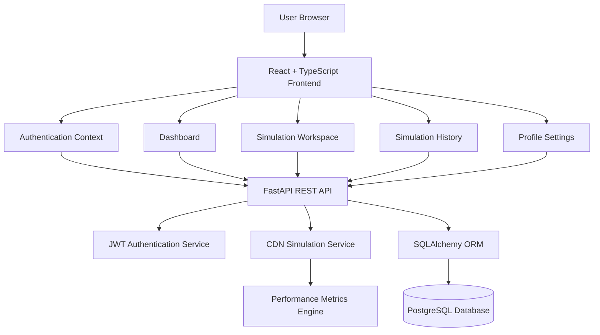
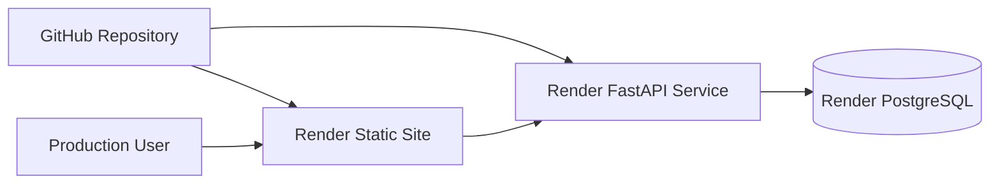

<div align="center">

# ⚡ EdgeMind

### Intelligent CDN Routing and Edge Performance Simulation Platform

**Visualize. Simulate. Optimize. Deliver.**

<br />


<br />


<br />


</div>

---

## 🌐 Project Overview

**EdgeMind** is a full-stack intelligent Content Delivery Network simulation platform.

It demonstrates how a request can travel through a global edge network and how intelligent routing decisions can reduce latency, improve cache efficiency, lower origin-server load, and create a faster user experience.

Instead of presenting CDN concepts only as static diagrams, EdgeMind turns them into an interactive simulation environment.

The core workflow is:

```text
Client Request → Global Routing → Edge Selection → Performance Analysis → Results
```

Users can configure a simulation, observe the routing process, compare performance metrics, save completed simulations, and review historical results from a personalized dashboard.

The platform is designed for:

- CDN and edge-computing demonstrations
- network-performance education
- full-stack engineering portfolios
- routing and caching simulations
- system-design presentations
- software engineering interviews

---

## 🚀 Core Features

| Feature | Description |
|---|---|
| 🌍 **Global Edge Visualization** | Displays request movement across an international edge network |
| ⚡ **Interactive CDN Simulator** | Allows users to configure and run routing simulations |
| 🧠 **Intelligent Route Selection** | Models routing decisions using latency and network conditions |
| 📊 **Performance Metrics** | Presents latency, cache, throughput, and routing results |
| 🗺️ **Multi-Region Network** | Visualizes nodes across Europe, North America, Asia, and the Middle East |
| 🔐 **Secure Authentication** | Supports account registration, login, and JWT authentication |
| 🛡️ **Protected Routes** | Restricts dashboards and simulations to authenticated users |
| 💾 **Saved Simulations** | Stores completed simulation records in the database |
| 📚 **Simulation History** | Provides searchable and paginated historical results |
| 👤 **Profile Settings** | Allows users to update account and profile information |
| 🔔 **Notification System** | Displays success, error, and validation feedback |
| 📱 **Responsive Interface** | Supports desktop, tablet, and mobile screen sizes |
| 🧪 **Automated Testing** | Includes frontend, backend, and browser-based tests |
| ☁️ **Production Deployment** | Prepared for Render and PostgreSQL deployment |

---

## 🧩 System Architecture



---

## 🤖 Simulation Workflow

EdgeMind follows a structured simulation pipeline.

### 1. Request Configuration

The user defines simulation conditions such as traffic, routing preferences, network state, or request characteristics.

### 2. Input Validation

The frontend validates the configuration before submitting it to the backend.

### 3. Network Analysis

The simulator evaluates the available routing conditions and candidate edge locations.

### 4. Edge Selection

A suitable edge route is selected based on the simulation rules and performance conditions.

### 5. Metric Calculation

EdgeMind calculates and presents performance information such as latency, cache behavior, routing path, and origin impact.

### 6. Result Visualization

The frontend converts the simulation response into an interactive results view.

### 7. Database Persistence

Authenticated users can save simulation results for future review.

### 8. Historical Analysis

Saved simulations appear in the history page with pagination and management controls.

```text
Configuration
     ↓
Validation
     ↓
Network Analysis
     ↓
Edge Route Selection
     ↓
Metric Calculation
     ↓
Result Visualization
     ↓
Database Storage
```

---

## 🛠️ Technology Stack

### Frontend

| Technology | Purpose |
|---|---|
| React | Component-based application interface |
| TypeScript | Static typing and safer frontend development |
| Vite | Development server and production bundling |
| React Router | Client-side navigation and protected routes |
| Tailwind CSS | Responsive interface styling |
| Context API | Authentication and notification state |
| Fetch API | Backend communication |
| Vitest | Frontend unit and integration testing |
| Playwright | End-to-end browser testing |

### Backend

| Technology | Purpose |
|---|---|
| FastAPI | REST API framework |
| Python | Backend application logic |
| Pydantic | Request validation and application settings |
| SQLAlchemy | Database ORM and session management |
| Alembic | Database schema migrations |
| Psycopg | PostgreSQL database driver |
| PyJWT | Access-token generation and validation |
| Argon2 | Secure password hashing |
| Uvicorn | ASGI application server |
| Pytest | Backend automated testing |

### Database and Infrastructure

| Technology | Purpose |
|---|---|
| SQLite | Local development database |
| PostgreSQL | Production database |
| Git | Version control |
| GitHub | Source-code hosting |
| Render | Frontend, backend, and database deployment |
| YAML Blueprint | Infrastructure configuration |

---

## 🌍 Simulated Edge Network

The EdgeMind visual experience represents a global edge-delivery network containing locations such as:

| Region | Example Edge Locations |
|---|---|
| Europe | Warsaw, Frankfurt, London |
| North America | New York |
| Middle East | Abu Dhabi |
| Southeast Asia | Singapore, Jakarta |

The network visualization demonstrates how requests move between clients, edge nodes, routing infrastructure, and origin systems.

---

## 📁 Project Structure

```text
EdgeMind/
├── backend/
│   ├── app/
│   │   ├── api/
│   │   │   └── API routes and dependencies
│   │   ├── core/
│   │   │   └── Configuration and security
│   │   ├── db/
│   │   │   └── Database engine and sessions
│   │   ├── models/
│   │   │   └── SQLAlchemy database models
│   │   ├── schemas/
│   │   │   └── Pydantic request and response models
│   │   ├── services/
│   │   │   └── Authentication and simulation logic
│   │   └── main.py
│   │
│   ├── migrations/
│   │   └── Alembic migration files
│   │
│   ├── tests/
│   │   └── Backend API test suite
│   │
│   ├── alembic.ini
│   ├── requirements.txt
│   └── .env.example
│
├── e2e/
│   └── Playwright browser tests
│
├── public/
│   └── Static frontend assets
│
├── src/
│   ├── components/
│   │   └── Shared interface components
│   ├── contexts/
│   │   └── Authentication and notification state
│   ├── pages/
│   │   └── Landing, dashboard, simulator, and settings
│   ├── services/
│   │   └── Frontend API services
│   ├── types/
│   │   └── TypeScript data models
│   └── main.tsx
│
├── package.json
├── playwright.config.ts
├── render.yaml
├── vite.config.ts
└── README.md
```

---

## ⚙️ Installation Guide

### 1. Clone the Repository

```bash
git clone https://github.com/Eman0989/EdgeMind.git
cd EdgeMind
```

Because the repository is currently private, the GitHub account cloning it must have access.

---

## 🐍 Backend Setup

Open a terminal from the project directory:

```bash
cd backend
```

Create the Python virtual environment:

```bash
python3 -m venv .venv
```

Activate it on macOS or Linux:

```bash
source .venv/bin/activate
```

Install backend dependencies:

```bash
pip install -r requirements.txt
```

Create the local environment file:

```bash
cp .env.example .env
```

Apply database migrations:

```bash
alembic upgrade head
```

Start the FastAPI backend:

```bash
uvicorn app.main:app --reload
```

The backend runs at:

```text
http://127.0.0.1:8000
```

Interactive API documentation:

```text
http://127.0.0.1:8000/docs
```

---

## ⚛️ Frontend Setup

Open a second terminal and return to the EdgeMind project root:

```bash
cd /Users/mac/Desktop/EdgeMind
```

Install frontend dependencies:

```bash
npm install
```

Start the Vite development server:

```bash
npm run dev
```

The frontend normally runs at:

```text
http://127.0.0.1:5173
```

---

## 🔐 Environment Configuration

### Backend

The backend reads configuration from:

```text
backend/.env
```

Example development configuration:

```env
APP_NAME=EdgeMind API
APP_VERSION=0.1.0
ENVIRONMENT=development
DEBUG=true

API_PREFIX=/api
HOST=127.0.0.1
PORT=8000

CORS_ORIGINS=http://localhost:5173,http://127.0.0.1:5173
DATABASE_URL=sqlite:///./edgemind.db

JWT_ALGORITHM=HS256
SECRET_KEY=replace-with-a-long-random-secret
ACCESS_TOKEN_EXPIRE_MINUTES=60
```

### Frontend

The frontend supports the following environment variable:

```env
VITE_API_BASE_URL=http://127.0.0.1:8000
```

Production secrets and real `.env` files must never be committed to GitHub.

---

## ▶️ How to Use EdgeMind

1. Open the EdgeMind landing page.
2. Create a new account or sign in.
3. Open the protected dashboard.
4. Select **New Simulation**.
5. Configure the simulation conditions.
6. Start the CDN simulation.
7. Observe the global request-routing sequence.
8. Review the generated performance results.
9. Save the simulation to your account.
10. Open the simulation-history page.
11. Review or delete previously saved simulations.
12. Update account information from the settings page.

---

## 📊 Simulation Output

EdgeMind presents structured performance information after a simulation.

| Metric | Meaning |
|---|---|
| Request Route | Path followed through the simulated network |
| Selected Edge | Edge location chosen for delivery |
| Latency | Estimated request-response delay |
| Cache Status | Whether content was delivered from cache |
| Cache Efficiency | Effectiveness of edge caching |
| Origin Requests | Requests that still reached the origin |
| Throughput | Simulated data-delivery performance |
| Improvement | Difference between baseline and optimized routing |
| Simulation Status | Completion or failure state |

---

## 🔌 Main API Endpoints

| Method | Endpoint | Purpose |
|---|---|---|
| GET | `/api/health` | Check backend health |
| POST | `/api/auth/register` | Register a user |
| POST | `/api/auth/login` | Authenticate a user |
| GET | `/api/auth/me` | Read the current profile |
| PATCH | `/api/auth/me` | Update the current profile |
| GET | `/api/dashboard` | Retrieve dashboard information |
| GET | `/api/simulations` | List saved simulations |
| POST | `/api/simulations` | Create a simulation record |
| GET | `/api/simulations/{simulation_id}` | Read one simulation |
| PUT | `/api/simulations/{simulation_id}` | Update one simulation |
| DELETE | `/api/simulations/{simulation_id}` | Delete one simulation |

Protected routes require an access token:

```http
Authorization: Bearer <access_token>
```

---

## 🗄️ Database Management

EdgeMind uses Alembic for schema migrations.

Apply all current migrations:

```bash
cd backend
source .venv/bin/activate
alembic upgrade head
```

Create a migration after changing a database model:

```bash
alembic revision --autogenerate -m "Describe database change"
```

Apply the new migration:

```bash
alembic upgrade head
```

Local development uses SQLite, while the production deployment is configured to use PostgreSQL.

---

## 🧪 Automated Testing

### Frontend Tests

```bash
npm run test:run
```

Current result:

```text
38 frontend tests passing
```

### Backend Tests

```bash
cd backend
PYTHONPATH="$PWD" .venv/bin/python -m pytest -q
```

Current result:

```text
13 backend tests passing
```

### End-to-End Test

```bash
npm run test:e2e
```

The Playwright WebKit test verifies:

```text
Registration
    ↓
Protected Route Access
    ↓
Dashboard Loading
    ↓
Profile Settings
    ↓
Logout
    ↓
Login
```

### Production Build

```bash
npm run build
```

The React and TypeScript production build currently passes successfully.

---

## 🔒 Security

EdgeMind includes several application-security controls:

- Argon2 password hashing
- JWT access-token authentication
- protected API endpoints
- protected frontend routes
- authenticated simulation ownership
- Pydantic input validation
- configurable CORS origins
- environment-based secret management
- database foreign-key enforcement
- production secrets generated outside the repository
- separation between public and authenticated pages

No production password, JWT secret, or database credential should be committed to the repository.

---

## ☁️ Deployment Architecture



The included `render.yaml` Blueprint defines:

- the React static website
- the FastAPI backend service
- the PostgreSQL production database
- frontend and backend environment variables
- generated JWT secrets
- database migrations during startup
- backend health checks
- React Router rewrite rules
- automatic deployment from the `main` branch

---

## 📌 Project Highlights

```text
✅ Full-stack React and FastAPI architecture
✅ Interactive global CDN visualization
✅ Intelligent routing simulation concept
✅ JWT authentication
✅ Argon2 password hashing
✅ Protected frontend and backend routes
✅ Database-backed simulation history
✅ SQLAlchemy ORM integration
✅ Alembic schema migrations
✅ SQLite local-development support
✅ PostgreSQL production support
✅ Responsive desktop and mobile interface
✅ Form validation and notifications
✅ Frontend unit and integration tests
✅ Backend API tests
✅ Playwright end-to-end testing
✅ GitHub version control
✅ Render deployment Blueprint
```

---

## 🎥 Recommended Demonstration Flow

```text
1. Open the EdgeMind landing page
2. Play the global request animation
3. Register a new account
4. Open the protected dashboard
5. Start a new CDN simulation
6. Configure the network conditions
7. Run the simulation
8. Explain the selected edge route
9. Review the performance metrics
10. Save the simulation
11. Open simulation history
12. Update profile information
13. Show the FastAPI documentation
14. Run the automated tests
15. Show the GitHub repository
```

---

## 🎓 Learning and Engineering Value

EdgeMind demonstrates practical knowledge of:

- frontend application architecture
- REST API development
- relational database design
- authentication and authorization
- CDN and edge-computing concepts
- asynchronous API communication
- responsive interface design
- schema migrations
- automated testing
- browser-based end-to-end testing
- environment configuration
- source-control workflows
- cloud deployment preparation

---

## 👩‍💻 Author

### Emaan Javaid

Developer and project creator of **EdgeMind**.

GitHub username:

```text
Eman0989
```

---
## 🌐 Live Application

### Frontend

```text
https://edgemind-web-eman0989.onrender.com
```

### Backend Health Check

```text
https://edgemind-api-eman0989.onrender.com/api/health
```

### API Documentation

```text
https://edgemind-api-eman0989.onrender.com/docs
```

---

## 🌐 Repository

```text
https://github.com/Eman0989/EdgeMind
```

The repository is currently private.

---

## 🏁 Conclusion

EdgeMind demonstrates how modern frontend development, backend APIs, secure authentication, relational databases, automated testing, and CDN concepts can be combined into one complete software-engineering project.

The platform transforms an abstract infrastructure topic into an interactive experience where users can configure requests, observe global routing, analyze performance, and preserve simulation results.

EdgeMind is designed as both a technical portfolio project and a practical demonstration of full-stack system design.

---

<div align="center">

# ⚡ EdgeMind

### Visualize. Simulate. Optimize. Deliver.

<br />


<br />

**Built by Emaan Javaid**

<br />


</div>
